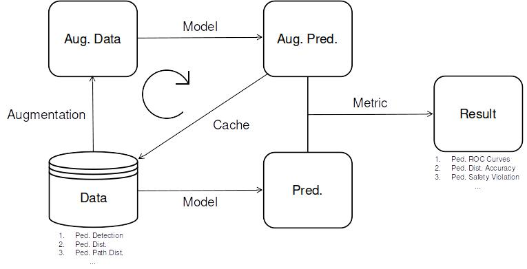

# APRTF
Robustness Testing Framework for Image Models in Autonomous Systems.

## Structure



##  Installation
```
conda create -n <env_name>
conda activate <env_name>

# pytorch (change to desired version)
conda install pytorch==2.0.0 torchvision==0.15.0 pytorch-cuda=11.7 -c pytorch -c nvidia

# data processing
conda install numpy matplotlib Pillow tqdm

# config, logging and metrics (not on conda)
pip install wandb yacs cython pycocotools --upgrade-strategy only-if-needed

# aprtf
cd <robust-perception-tas_directory>
python setup.py install
```

## Pedestrian Detection Finetuning
1. Format pedestrian detection dataset. Example scripts found in `data`.

Custom dataset files are expected to be formatted as follows:
```
{'image': <image_filepath>, 'annotations': [[xmin, ymin, xmax, ymax],...]}
...
```


2. Make configuration YAML file. 

Example `retinanet_resnet50_fpn-pennfudan.yaml`:
```
DATASET:
  path: ""
  LIST:
    train: "train_PennFudanPed.odgt"
    val: "val_PennFudanPed.odgt"

MODEL:
  arch: "retinanet_resnet50_fpn"

TRAIN:
  path: ""
  seed: -1
  DATA:
    batch_size: 32
    num_workers: 4
    disp_iter: 20
  LEN:
    num_epoch: 10
    start_epoch: 0
    early_stop: 2
  OPTIM:
    optim: "sgd"
    lr: 0.005
    momentum: 0.9
    weight_decay: 0.0005
  LR:
    schedule: 'step'
    step_size: 3
    gamma: 0.1
```

3. Run the training
```
python train.py -c <config_filepath> -i <train_val_odgt_dirpath> -o <checkpoint_dirpath>
```

4. Results are stored at the checkpoint directory. By default your directory will be set up as follows:
```
<DIR>
├── weights_best.pth        # checkpoint with best validation mAP
├── weights_epoch_<n>.pth   # last checkpoint whilst running
├── weights_final.pth       # final checkpoint if run finished
├── history.tsv             # training and validation metrics history
├── config.yaml             # configuration file (updated with train.py arguments)
└── log.txt                 # model training logs
```

## Evaluation

See the ```dev.ipynb``` for how the framework can be used on the [NuScenes](https://www.nuscenes.org/) dataset using the multi-stage analysis proposed in ["Perception robustness testing at different levels of generality"](https://www.journalfieldrobotics.org/FR/Papers_files/10_Pezzementi.pdf).

Many of the metrics are in the process of implementation, thus not accesible at this time:
- Pathifier (under implementation)
- Roboticizer (not started)
- Closed-Loop Control Simulator (not started)